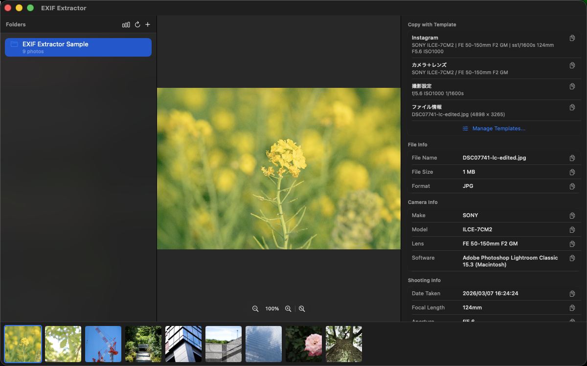
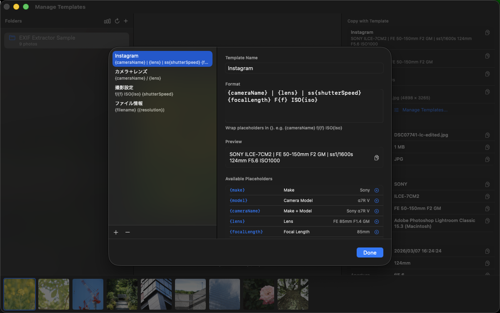
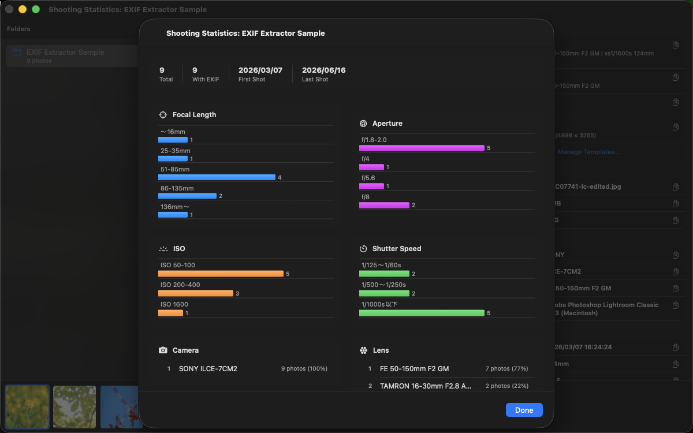
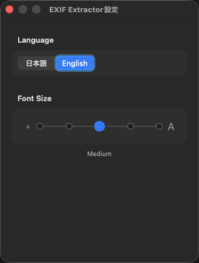

# EXIF Extractor

A macOS app for browsing photos and viewing their EXIF metadata — camera settings, lens info, GPS coordinates, and more — all in a clean, native interface.

## Features

### Photo Browser



- Navigate your photo library through a folder tree in the sidebar
- Browse photos in a thumbnail strip at the bottom of the window
- Use **arrow keys** (← / →) to move between photos
- View full-size images in the main photo viewer

### EXIF Metadata Panel
Displays the following metadata for each selected photo:

| Section | Fields |
|---|---|
| **File** | Filename, file size, format |
| **Camera** | Make, model, lens, software |
| **Shooting** | Date taken, focal length, aperture, ISO, shutter speed, exposure bias, white balance, flash |
| **Image** | Resolution, color space |
| **GPS** | Latitude, longitude, altitude |

Each field has a copy button so you can grab individual values with one click.

### Copy Templates



Define reusable text templates to copy shooting info in a consistent format. Built-in defaults include:

| Template | Example output |
|---|---|
| Basic | `Sony α7R V 85mm f/1.4 ISO800 1/250s` |
| Camera & Lens | `Sony α7R V / FE 85mm F1.4 GM` |
| Shooting settings | `f/1.4 ISO800 1/250s` |
| File info | `DSC01234.jpg (9504 × 6336)` |

You can create your own templates using the following placeholders:

`{make}` `{model}` `{cameraName}` `{lens}` `{focalLength}` `{f}` `{iso}` `{shutterSpeed}` `{ev}` `{date}` `{width}` `{height}` `{resolution}` `{filename}`

### Shooting Stats



Select a folder and open the Stats view to see aggregated charts and rankings across all photos in that folder:

- Distribution charts for focal length, aperture, ISO, and shutter speed
- Camera and lens usage rankings
- Summary: total photo count, EXIF-tagged count, and shooting date range

### Preferences



Open **Preferences** with **⌘,** to customize the app:

- **Language** — switch the app language between 日本語 and English
- **Font Size** — adjust the text size in the EXIF panel and copy templates (5 steps: XS / S / M / L / XL)

### Auto-Update
EXIF Extractor checks for new versions automatically using [Sparkle](https://sparkle-project.org/). When an update is available, you will be notified and can install it in one click — no need to visit the Releases page manually.

You can also check for updates at any time from the **EXIF Extractor** menu → **Check for Updates…**

### Help
Select **Help** from the menu bar to open the in-app Help window. It covers all keyboard shortcuts and a description of each feature.

## Requirements

- macOS 15.0 (Sequoia) or later

## Installation

1. Go to the [Releases](https://github.com/michimani/exif-extractor-macos/releases) page and download the latest `ExifExtractor-<version>.pkg` file.
2. Open the downloaded `.pkg` file.
3. Follow the on-screen installer steps — the app will be installed into `/Applications`.
4. Launch **EXIF Extractor** from Launchpad or Spotlight.

> The installer package is signed and notarized by Apple, so no additional steps are needed to allow it to run.

## Building from Source

Requirements: Xcode 16 or later.

```bash
git clone https://github.com/michimani/exif-extractor-macos.git
cd exif-extractor-macos
open ExifExtractor.xcodeproj
```

Select the **ExifExtractor** scheme and press **Run** (⌘R).

## License

MIT License. Copyright © 2026 michimani. See [LICENSE](./LICENSE) for details.
